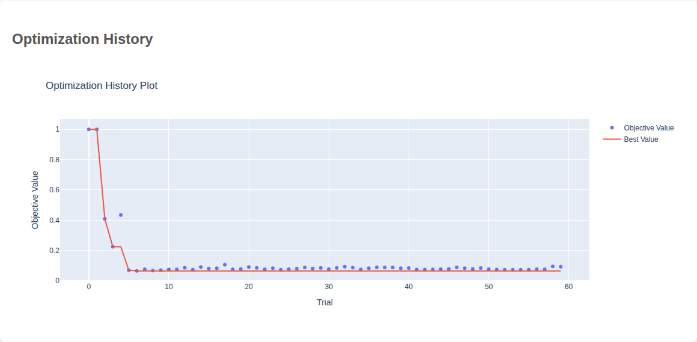
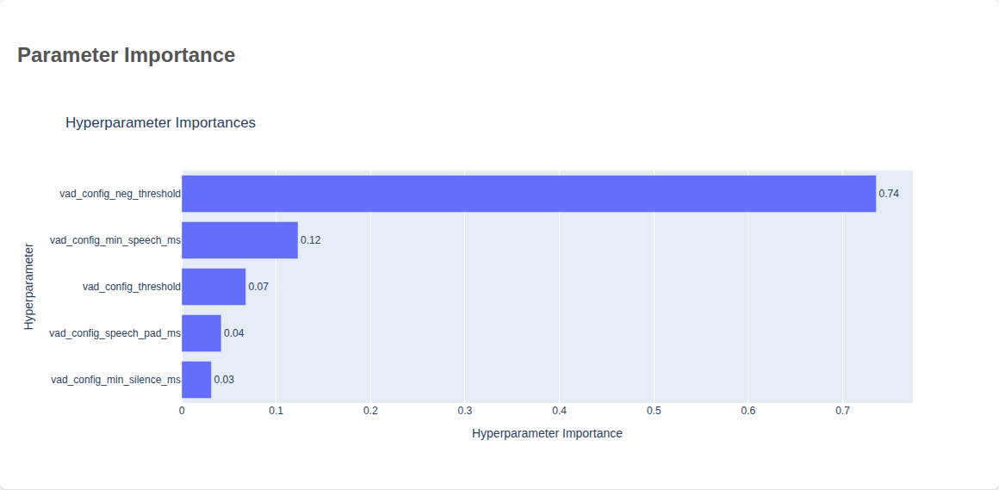
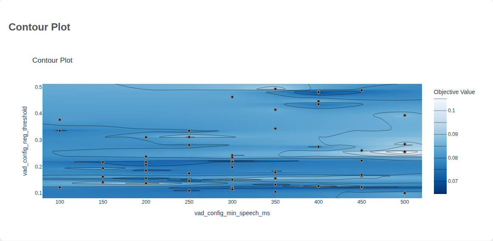
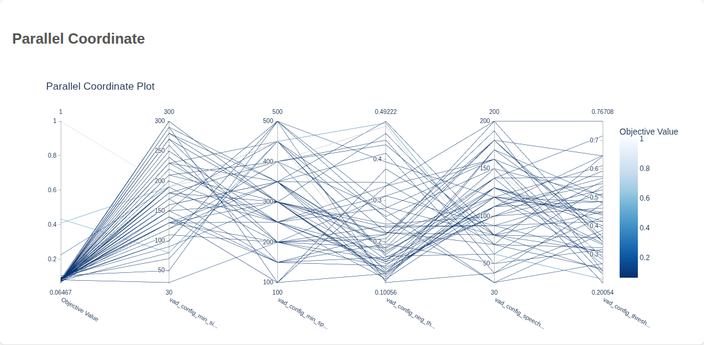

# VAD Bayesian 最適化によるパラメータチューニングガイド

> **対象バージョン:** livecap-core 1.0.0+
> **作成日:** 2025-11-29
> **関連:** [VAD 最適化計画](../planning/archive/vad-optimization-plan.md), [Issue #126](https://github.com/Mega-Gorilla/livecap-cli/issues/126)

このガイドでは、Bayesian Optimization（Optuna）を使用した VAD パラメータのチューニング方法と、生成されるレポートの読み方を説明します。

> **Note**: 言語に応じた最適な VAD を簡単に使いたい場合は、[リアルタイム文字起こしガイド](./realtime-transcription.md)の「言語別 VAD 最適化」セクションを参照してください。

---

## 概要

VAD（Voice Activity Detection）のパラメータを言語・ユースケースに合わせて最適化することで、文字起こし精度（CER/WER）を改善できます。

| コンポーネント | 役割 |
|---------------|------|
| `VADOptimizer` | Optuna ベースの Bayesian 最適化 |
| `VADObjective` | 目的関数（CER/WER 最小化） |
| `OptimizationReport` | HTML/JSON レポート生成 |

```
パラメータ探索空間
       ↓
   Optuna TPE
       ↓
  VAD + ASR 評価
       ↓
   CER/WER 計算
       ↓
  最適パラメータ
```

---

## クイックスタート

### インストール

```bash
# 最適化 + NeMo エンジン（推奨）
uv sync --extra engines-nemo --extra optimization

# TorchAudio CUDA インストール（CUDA 12.6 環境の場合）
uv pip install torchaudio==2.9.1+cu126 --index-url https://download.pytorch.org/whl/cu126
```

> **注意**: `uv sync` で複数の extra を使用する場合は、必ず同時に指定してください。
> 別々に実行すると依存関係が削除される場合があります。

### 基本的な実行

```bash
# Silero VAD を日本語向けに最適化（50 トライアル）
python -m benchmarks.optimization \
  --vad silero \
  --language ja \
  --n-trials 50 \
  --report
```

### 出力ファイル

```
benchmark_results/optimization/
├── studies.db              # Optuna SQLite ストレージ
└── reports/
    ├── silero_ja.html      # インタラクティブ HTML レポート
    └── silero_ja.json      # 最適パラメータ（JSON）
```

---

## CLI オプション

### 必須オプション

| オプション | 説明 | 例 |
|-----------|------|-----|
| `--vad` | 最適化対象の VAD バックエンド | `silero`, `tenvad`, `webrtc` |
| `--language`, `-l` | 対象言語 | `ja`, `en` |

※ javadは最適化をサポートしていません

### オプション引数

| オプション | デフォルト | 説明 |
|-----------|-----------|------|
| `--engine`, `-e` | 自動選択 | ASR エンジン ID |
| `--n-trials`, `-n` | 50 | 最適化トライアル数 |
| `--seed` | 42 | 乱数シード（再現性） |
| `--device` | cuda | 推論デバイス（`cuda` / `cpu`） |
| `--mode` | quick | データセットモード（`quick`: 30件, `standard`: 100件） |
| `--report` | False | レポート生成を有効化 |
| `--output`, `-o` | なし | 結果 JSON の出力パス |
| `--verbose`, `-v` | False | 詳細ログ出力 |

### 使用例

```bash
# 英語向け TenVAD 最適化（100 トライアル、standard モード）
python -m benchmarks.optimization \
  --vad tenvad \
  --language en \
  --n-trials 100 \
  --mode standard \
  --report

# 特定のエンジンを指定
python -m benchmarks.optimization \
  --vad silero \
  --language ja \
  --engine parakeet_ja \
  --n-trials 50 \
  --report

# CPU で実行
python -m benchmarks.optimization \
  --vad webrtc \
  --language ja \
  --device cpu \
  --n-trials 30 \
  --report
```

---

## 最適化パラメータ

### 共通パラメータ（VADConfig）

全ての VAD バックエンドで最適化される基本パラメータ：

| パラメータ | 探索範囲 | 説明 |
|-----------|----------|------|
| `threshold` | 0.2 - 0.7 | 音声判定閾値。高いほど厳格 |
| `neg_threshold` | 0.1 - 0.4 | 非音声判定閾値（Silero のみ） |
| `min_speech_ms` | 100 - 500 | 最小音声区間長（ms） |
| `min_silence_ms` | 30 - 200 | 最小無音区間長（ms） |
| `speech_pad_ms` | 50 - 200 | 音声前後のパディング（ms） |

### パラメータの影響

```
threshold ↑  → 音声検出が厳格に → 短い発話を見逃す可能性
threshold ↓  → 音声検出が緩く   → ノイズを音声と誤検出

min_speech_ms ↑ → 短い発話を無視 → 「はい」「うん」が欠落
min_speech_ms ↓ → 短い音も検出   → ノイズ誤検出増加

speech_pad_ms ↑ → 発話前後に余裕 → 文頭・文末の欠落防止
speech_pad_ms ↓ → タイトな切り出し → レイテンシ改善
```

### VAD 固有パラメータ

| VAD | パラメータ | 探索範囲 | 説明 |
|-----|-----------|----------|------|
| TenVAD | `hop_size` | [160, 256] | フレームホップサイズ |
| WebRTC | `mode` | [0, 1, 2, 3] | 攻撃性モード（3が最も厳格） |

---

## HTML レポートの読み方

`--report` フラグを指定すると、4種類のインタラクティブチャートを含む HTML レポートが生成されます。

### 1. Optimization History（最適化履歴）



**読み方:**
- **X軸**: トライアル番号
- **Y軸**: 目的関数値（CER/WER）
- **青点**: 各トライアルの結果
- **緑線**: ベスト値の推移

**確認ポイント:**
- 収束しているか？（後半で値が安定）
- 改善が続いているか？（続く場合はトライアル数を増やす）

### 2. Parameter Importance（パラメータ重要度）



**読み方:**
- 各パラメータが目的関数に与える影響度を表示
- バーが長いほど重要なパラメータ

**活用方法:**
- 重要度の低いパラメータは固定値にして探索空間を削減
- 重要度の高いパラメータは探索範囲を広げる検討

### 3. Contour Plot（等高線プロット）



**読み方:**
- 重要度上位 2 パラメータの相互作用を可視化
- 色が濃い領域が良い値（低 CER/WER）
- 等高線で最適領域の形状を把握

**確認ポイント:**
- 最適領域が明確か？（はっきりした谷/ピーク）
- 複数の最適領域があるか？（多峰性）

### 4. Parallel Coordinate（並行座標プロット）



**読み方:**
- 各縦軸がパラメータ
- 各線が 1 トライアル
- 色が目的関数値を表現

**活用方法:**
- 良いトライアル（色の薄い線）のパラメータ傾向を把握
- パラメータ間の相関を視覚的に確認

---

## JSON 出力フォーマット

```json
{
  "study_name": "silero_ja",
  "vad_type": "silero",
  "language": "ja",
  "best_trial": 42,
  "best_cer": 0.0647,
  "best_params": {
    "vad_config_threshold": 0.294,
    "vad_config_neg_threshold": 0.123,
    "vad_config_min_speech_ms": 450,
    "vad_config_min_silence_ms": 190,
    "vad_config_speech_pad_ms": 150
  },
  "n_trials": 50,
  "created_at": "2025-11-29T14:27:30.624074"
}
```

---

## ベストプラクティス

### 推奨トライアル数

| 目的 | トライアル数 | 所要時間（目安） |
|------|-------------|-----------------|
| クイックテスト | 10-20 | 1-3 分 |
| 標準最適化 | 50-100 | 10-20 分 |
| 本番用最適化 | 200+ | 1 時間以上 |

### エンジン選択

| 言語 | 推奨エンジン | 備考 |
|------|-------------|------|
| 日本語 | `parakeet_ja` | 高精度、NeMo 依存 |
| 日本語（軽量） | `whispers2t_base` | NeMo 不要 |
| 英語 | `parakeet` | 高精度 |

### 再現性の確保

```bash
# シードを固定して再現可能な結果を得る
python -m benchmarks.optimization \
  --vad silero \
  --language ja \
  --seed 42 \
  --n-trials 50 \
  --report
```

---

## Optuna Dashboard（リアルタイム監視）

長時間の最適化実行時は、Optuna Dashboard でリアルタイム監視できます：

```bash
# Dashboard をインストール
pip install optuna-dashboard

# Dashboard を起動
optuna-dashboard sqlite:///benchmark_results/optimization/studies.db
```

ブラウザで `http://localhost:8080` を開くと：
- リアルタイムで最適化進捗を確認
- パラメータ重要度の変化を監視
- トライアル詳細を確認

---

## スタディデータの管理

最適化結果は SQLite データベースに保存されます。各 VAD×言語の組み合わせは別々のスタディとして管理されるため、異なる VAD で実行しても上書きされません。

### データベース構造

```
benchmark_results/optimization/
└── studies.db              # 全スタディを格納
    ├── silero_ja           # --vad silero --language ja
    ├── silero_en           # --vad silero --language en
    ├── tenvad_ja           # --vad tenvad --language ja
    └── ...
```

### スタディ一覧の確認

```bash
# Optuna CLI でスタディ一覧を表示
optuna studies --storage sqlite:///benchmark_results/optimization/studies.db
```

Python で詳細を確認：

```python
import optuna

storage = "sqlite:///benchmark_results/optimization/studies.db"
studies = optuna.get_all_study_summaries(storage)
for s in studies:
    print(f"{s.study_name}: {s.n_trials} trials, best={s.best_trial.value:.4f}")
```

### スタディの削除

```bash
# 特定のスタディを削除
optuna delete-study \
  --storage sqlite:///benchmark_results/optimization/studies.db \
  --study-name silero_ja
```

### 全データのリセット

```bash
# DB ファイルを削除して完全リセット
rm benchmark_results/optimization/studies.db
```

### 実験ごとに DB を分離

```bash
# 別ディレクトリに保存して実験を分離
python -m benchmarks.optimization \
  --vad silero --language ja \
  --output-dir benchmark_results/optimization/experiment_v2
```

### バックアップ

```bash
# 単純なファイルコピーでバックアップ
cp benchmark_results/optimization/studies.db \
   benchmark_results/optimization/studies_backup_$(date +%Y%m%d).db
```

### トライアルの追加実行

同じ VAD + 言語で再実行すると、既存スタディにトライアルが**追加**されます（累積）：

```bash
# 最初の実行: 50 トライアル
python -m benchmarks.optimization --vad silero --language ja --n-trials 50

# 追加実行: さらに 50 トライアル（合計 100 トライアル）
python -m benchmarks.optimization --vad silero --language ja --n-trials 50
```

リセットして最初からやり直したい場合は、スタディを削除してから再実行してください。

---

## トラブルシューティング

### CUDA メモリ不足

```bash
# CPU で実行
python -m benchmarks.optimization --device cpu ...

# または小さいエンジンを使用
python -m benchmarks.optimization --engine whispers2t_tiny ...
```

### NeMo エンジンのエラー

```bash
# engines-nemo + optimization を同時にインストール
uv sync --extra engines-nemo --extra optimization

# TorchAudio の CUDA バージョン不一致
uv pip install torchaudio==2.9.1+cu126 --index-url https://download.pytorch.org/whl/cu126
```

### 最適化が収束しない

- トライアル数を増やす（`--n-trials 100` など）
- `--mode standard` でデータ数を増やす
- 探索範囲が適切か確認（パラメータ空間の見直し）

---

## 関連ドキュメント

- [VAD バックエンド比較](../reference/vad-comparison.md)
- [VAD 最適化計画](../planning/archive/vad-optimization-plan.md)
- [Optuna 公式ドキュメント](https://optuna.readthedocs.io/)

---

🤖 Generated with [Claude Code](https://claude.com/claude-code)
